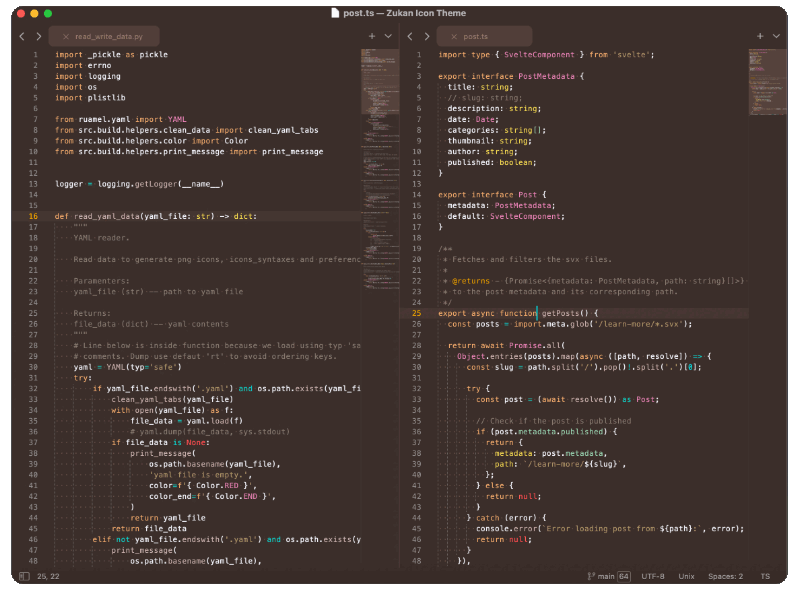
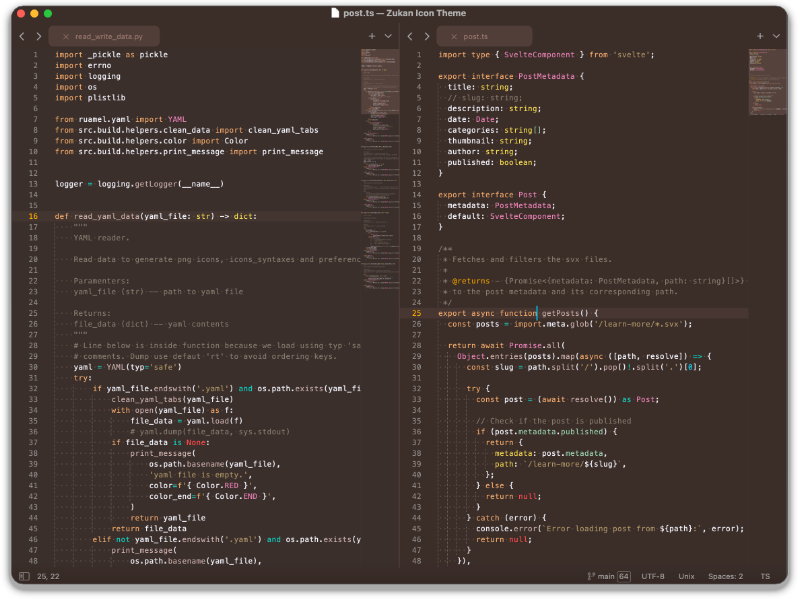
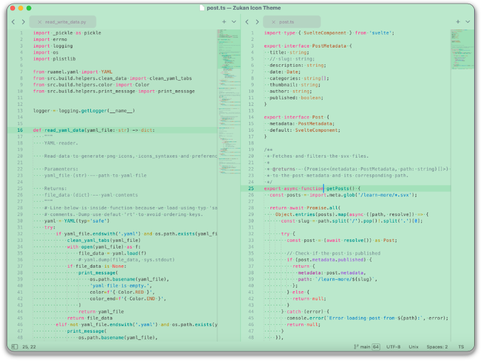
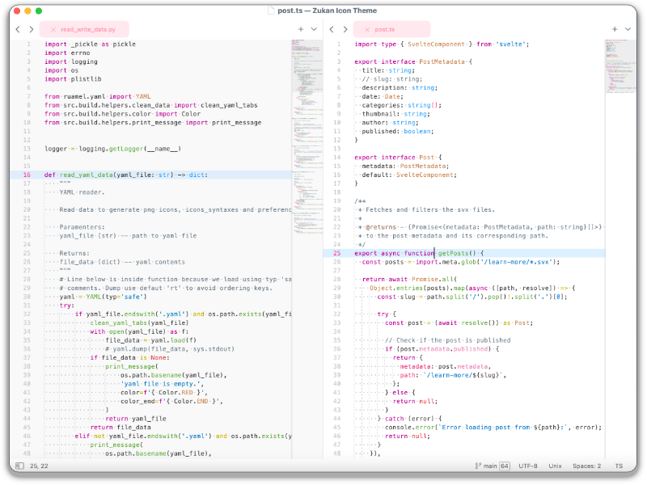
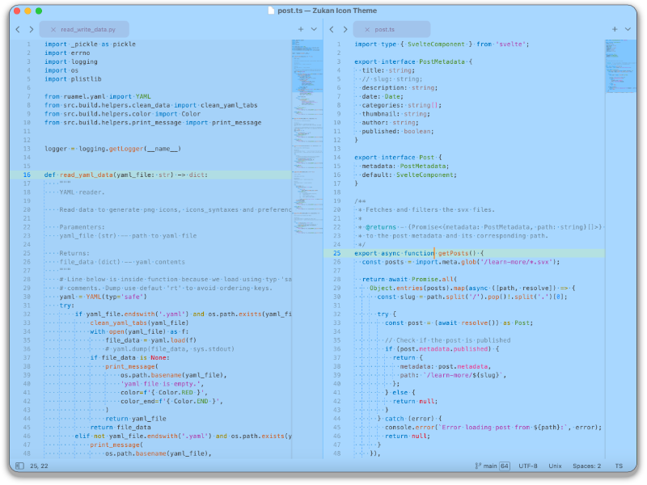
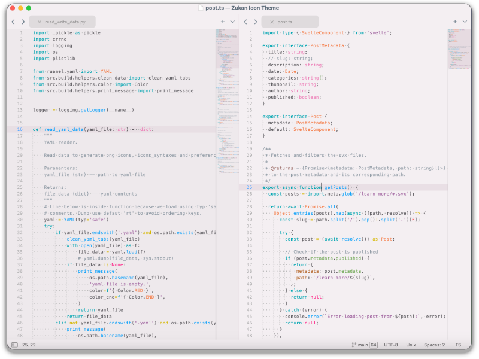
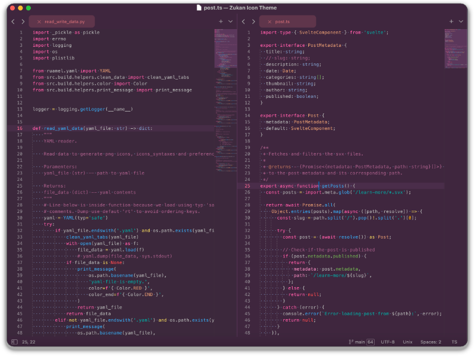
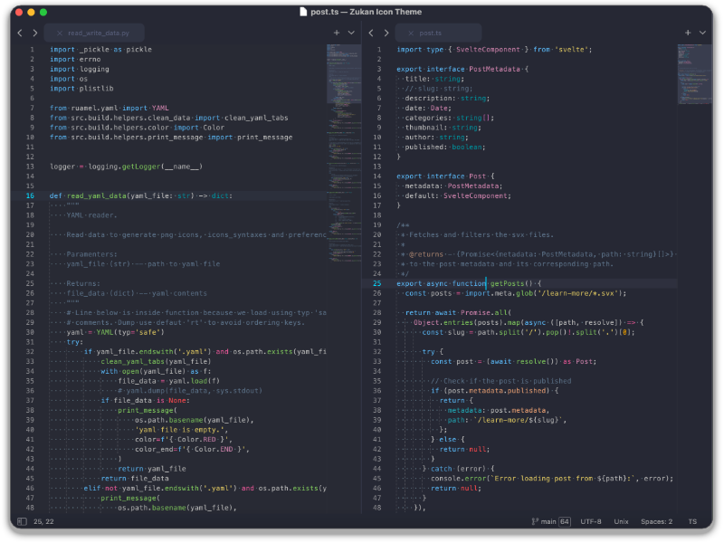

    

## Color scheme Bass

Color-schemes available are (Click name to view)

  
Bass Biohack

  

  
Bass Blackcomb

  

  
Bass Bowtruckle

  

  
Bass D-O

  

  
Bass Fuji

  

  
Bass Lagoon

  

  
Bass Nimbus

  

  
Bass Roci

  

  
Bass Zora

  

> Screenshots from v0.1.11

> In screenshots, we are using Theme Treble  
[Theme - Treble](https://github.com/53v3n3d4/Theme-Treble)  

> Note: Highligth import Class js is possible if customize JavaScript.sublime-syntax

## Package installation

The recommended way to install is through [PackageControl.io](https://packagecontrol.io/packages/Color%20Scheme%20-%20Bass).  
- Menu `Tools > Command Palette > Package Control: Install Package`  
- Type `Bass`, search for `Color Scheme - Bass`  
- Click to install it  

To install manually, [download](https://github.com/53v3n3d4/Color-Scheme-Bass/releases) the latest release version zip file and uncompress it on your Sublime Text `Packages` folder.  
- Download the zip file on [`releases`](https://github.com/53v3n3d4/Color-Scheme-Bass/releases) page  
- Menu `Sublime Text > Preferences > Browse packages...` to open destination folder  
- Then unzip `Color Scheme - Bass zip file` inside `Packages` folder  

## Uninstall

To remove package using Package Control.  
- Menu `Tools > Command Palette > Package Control: Remove Package`  
- Click on `Color Scheme - Bass`  

To uninstall manually, go to your Sublime Text folder.  
- Menu `Sublime Text > Preferences > Browse packages...`  
- Then delete `Color Scheme - Bass` inside `Packages` folder  

## License

MIT license ([LICENSE-MIT](LICENSE))
